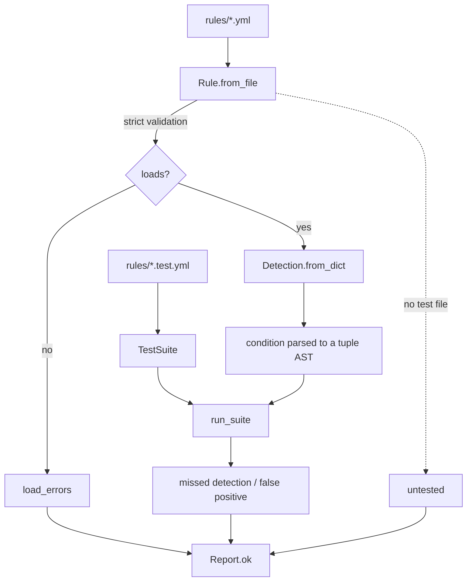

# ruleproof

Unit tests for [Sigma](https://github.com/SigmaHQ/sigma) detection rules.

A detection rule that matches nothing looks exactly like a detection rule for a threat
that never fired. Both produce silence. `ruleproof` makes a rule prove it fires on the
thing it was written for, and stays quiet on the things it wasn't.

```console
$ ruleproof test rules
10 rule(s) tested, 93 case(s), 0 failure(s), 0 untested, 0 orphaned, 0 error(s)
$ echo $?
0
```

When something is wrong it says which kind of wrong, and returns non-zero:

```console
$ ruleproof test rules      # after someone loosens a rule
  FAIL   Local Account Created via net.exe
         false positive: querying one account - contains ' user ' but no /add
  UNTESTED  rules/windows/lsass_dump.yml
  ORPHANED  rules/windows/renamed_rule.test.yml  (test file with no rule beside it)

6 rule(s) tested, 49 case(s), 1 failure(s), 1 untested, 1 orphaned, 0 error(s)

untested rules are failures by default; pass --allow-untested to tolerate them
$ echo $?
1
```

## The idea it's built around

**Untested is a result, not an absence.**

A rule directory reports green very easily. Every rule that loads, loads. Every rule with
no tests has no failing tests. That is how a detection library rots — not by failing, but
by never being asked. So:

- a rule with no test file is a **failure**, not a blank (`--allow-untested` exists for
  adopting an existing rule set, but you have to ask for it in writing);
- `coverage` reports **claimed** ATT&CK techniques separately from **demonstrated** ones.
  The gap between those two numbers is the honest measure of a detection library.

The two failure kinds are never blurred, because they mean opposite things to whoever has
to act on them:

| kind | meaning | why it matters |
|---|---|---|
| **missed detection** | a `true_positives` case did not fire | the rule was silent during the thing it exists to catch |
| **false positive** | a `true_negatives` case fired | this is how a rule gets muted in production, after which it protects nothing |

A third kind was added after the tool caught it happening here: an **orphaned** test file,
one with no rule beside it. It is the mirror of an untested rule and the same failure in the
other direction — a rule with no tests scores nothing, a test with no rule tests nothing, and
both report green. This one is arguably worse, because the file sitting in the directory
implies coverage that is not there. It happens when a rule is renamed or deleted and its tests
are left behind, and unlike untested rules it is **not** covered by `--allow-untested`:
adopting somebody else's rule set explains rules without tests, but nothing explains a test
file whose rule does not exist.

## Coverage against reality, not against your own claims

`coverage` lets a rule set grade its own homework. It reports the techniques your rules
**claim** against the ones they **prove** — useful, but a library can score 100% on that and
still detect nothing anyone is actually being attacked with, because it chose what to claim in
the first place.

`gap` asks the question from outside. Point it at any source of ATT&CK identifiers observed in
real data — threat-intel notes, a SIEM export, a text file — and it reports what fraction of
what you are *actually seeing* you would catch.

A snapshot of real observed activity ships with the repo, so this runs with nothing else
cloned:

```console
$ ruleproof gap rules samples/observed-techniques.txt --limit 3
Observed techniques      : 43
Demonstrated by rules    : 10
Observed AND detected    : 15  (35%)
Observed, NOT detected   : 28

COVERED - seen in the data and provably detected
  ...

GAP - most-observed techniques with no demonstrated detection
  T1190          25 source(s)
  T1056.001       4 source(s)
  T1068           4 source(s)
  ... and 25 more (--limit to show)

2 of 10 demonstrated technique(s) were never observed in this data: T1053.005, T1136.001
  Not wrong on its own, but if it is most of the rule set the rules were chosen from
  general knowledge rather than from the evidence in hand.
```

Two things that output is designed to make unavoidable:

- **The gap is ranked by how often each technique was actually seen**, so it names the next rule
  to write instead of leaving you with a percentage. Above, `T1190` is both the most-observed
  technique in the data and completely undetected.
- **Rules aimed at things you have never seen are reported separately.** Defending against
  something that has not hit you yet is legitimate; discovering that it describes most of your
  rule set means the rules came from general knowledge rather than from evidence you already
  had. That is what the author found on the first real run of this command.

`--fail-under PCT` exits 1 below a threshold, so CI can stop coverage regressing the same way
`test` stops rules rotting — **this repo's own CI gates on it**, which is the difference between
a number in a README and a number that stays true. `--limit N` controls how much of the gap is
listed.

`samples/observed-techniques.txt` is a snapshot of what the [threat-intel-pipeline][pipeline]
observed: 43 techniques across 128 sightings, one line per sighting, since the repetition is
what ranks the gap. They are public ATT&CK identifiers and nothing else — no indicators, no
customer data. Point the command at your own data and it reports your coverage instead.

The snapshot is regenerated by `python scripts/snapshot_observed.py <dir>`, not maintained by
hand. A figure that can only be refreshed by editing a file goes stale the moment the data
moves — which is the failure this whole command exists to catch, one level up.

The dependency runs one way on purpose: this reads *a file or directory containing ATT&CK
identifiers*, with no schema and no import. It knows nothing about where the data came from,
and so has nothing to keep up with.

## Quickstart

```bash
pip install pyyaml
python -m ruleproof.cli test rules        # exit 1 on failures or untested rules
python -m ruleproof.cli coverage rules    # ATT&CK claimed vs. demonstrated
python -m ruleproof.cli gap rules samples/observed-techniques.txt   # ...vs. what is being seen
```

A rule and its tests sit side by side:

```
rules/windows/local_account_created_net.yml
rules/windows/local_account_created_net.test.yml
```

```yaml
# local_account_created_net.test.yml
true_positives:
  - name: net1.exe variant used to evade a name-only rule
    event:
      EventID: 4688
      Image: 'C:\Windows\System32\net1.exe'
      CommandLine: 'net1 user attacker Passw0rd! /add'

true_negatives:
  - name: querying one account - contains ' user ' but no /add
    event:
      EventID: 4688
      Image: 'C:\Windows\System32\net.exe'
      CommandLine: 'net user alice /domain'
```

That negative is doing real work. See below.

## Do the tests actually test anything?

Every rule passing on the first run is indistinguishable from a rule set whose tests assert
nothing. `scripts/mutation_check.py` breaks each rule on purpose and checks its suite
notices:

```console
$ python scripts/mutation_check.py
  killed (false positive)     windows/local_account_created_net.yml: drop the /add discriminator (widens to any 'net user')
  killed (missed detection)   windows/local_account_created_net.yml: forget the net1.exe alias (attacker evades by name)
  killed (refused to load)    linux/webserver_spawns_shell.yml: drop the parent-process constraint
  ...
21 killed, 0 survived, 0 skipped
```

This found two genuine holes the first time it ran, both in rules that were passing:

1. The negative for `net user` never contained `' user '` (no trailing space), so widening
   the rule went unnoticed. Fixed by adding `net user alice /domain` — which *does* contain
   `' user '` and no `/add`, so it fails the moment the discriminator is dropped.
2. A `-Encoding` exclusion filter turned out to be **dead code**: no `-Encoding` command can
   match `' -enc '` with its trailing space, so the filter was guarding against nothing. It
   was deleted rather than left in looking protective.

Mutation checking runs in CI.

### The mutation check earned its keep

While writing the T1219 rule, one mutation **survived**: loosening the tool-name match from
`endswith` to `contains` failed no test at all. The near-miss negative meant to guard that —
`anydesk-support-notes.exe` — never contained the string `\AnyDesk.exe` in the first place, so
it had never tested the distinction. It only looked like it did.

The fix was a case that does contain it: `client32.exe.tmp`, a partial download whose name runs
past the executable. `contains` fires on it; `endswith` does not.

That is the argument for mutation testing in three lines. The suite was green, the rule was
correct, and one of its constraints was guarded by a test that asserted nothing. Nothing else in
the toolchain would have said so.

## How it works



Four layers, each with its own tests:

| module | job |
|---|---|
| `matching.py` | does one event field satisfy one Sigma condition |
| `detection.py` | search identifiers (map = AND, list = OR) + the `condition` language |
| `rule.py` | load and validate a rule file; extract ATT&CK tags |
| `harness.py` | run suites, classify failures, report coverage |

### Two decisions worth stating

**The condition is parsed, never `eval()`-ed.** Rules are data that arrives from outside the
tool — that is the whole point of Sigma being portable. `condition: selection and not filter`
is tokenised and parsed by recursive descent into a tuple AST. It never becomes executable
Python.

**Everything that can be validated at load time is.** An unsupported modifier, an unknown
search identifier, an unparseable condition, a multi-document file — all refused when the
rule is read, by filename, with the reason. A rule this tool cannot fully evaluate must
never be able to sit in a directory looking healthy. That is why `|base64offset` raises
instead of quietly falling back to equality: a rule that is deployed, green, and blind is
worse than a rule that failed to load.

## Sigma support

Implemented and tested: `contains`, `startswith`, `endswith`, `re`, `all`; wildcards `*`
and `?` with backslash escaping; case-insensitive plain values and case-sensitive `|re`;
map/list AND/OR semantics; `null` matching absent-or-null; `and` / `or` / `not` /
parentheses with correct precedence; `1 of them`, `all of them`, `1 of prefix_*`.

**Not implemented:** `|base64offset`, `|utf16`, `|cidr`, `|expand`, correlation rules,
multi-document rule collections, and field mapping to specific SIEM backends. All of these
raise at load time rather than being approximated.

This is an evaluator for testing rules against sample events, not a backend that converts
Sigma into SIEM queries — use [pySigma](https://github.com/SigmaHQ/pySigma) for that.

## The rules in this repo

Nine rules across Windows, Linux, and network telemetry, each with true positives and
near-miss negatives:

| rule | ATT&CK | why this one |
|---|---|---|
| Local account created via `net.exe` | T1136.001 | |
| PowerShell encoded command | T1059.001 | |
| ClickFix paste-and-run via the Run dialog | T1204.004 | |
| Scheduled task from a user-writable path | T1053.005 | |
| Web server process spawns a shell | T1505.003 | |
| Outbound connection to known C2 infrastructure | T1071.001 | |
| Commodity RAT C2 on a non-standard port | T1571 | **chosen by `gap`** |
| Remote access tool from a user-writable path | T1219 | **chosen by `gap`** |
| LOLBin downloading to a user-writable path | T1105 | **chosen by `gap`** |
| Script host executing a browser download | T1189 | **chosen by `gap`** |

They are drawn from activity in the [threat-intel-pipeline][pipeline] weekly reports —
the ClickFix rule covers the SmartApeSG/ClearFake/FAKEUPDATES delivery chain, the web-shell
rule covers the class of unauthenticated command injection that Zimbra CVE-2026-73570
belongs to, and the C2 rule uses indicators from
[2026-W35][w35].

That pairing is the point of building this one second: **the pipeline says what is being
exploited; ruleproof says whether I would catch it.**

The last rule in that table was not chosen by intuition. `ruleproof gap` reported T1571 as the
second most-observed technique in the pipeline's data — 9 sources — with no detection at all,
so it was the obvious next one to write. Adding it moved observed coverage from **26% to 28%**,
then T1219 (Remote Access Tools), T1105 (Ingress Tool Transfer) and T1189 (Drive-by Compromise)
took it to **35%**. All four rules were picked by the measurement rather than by taste.

One technique on that list is deliberately **not** attempted: **T1190, Exploit Public-Facing
Application** — the most-observed technique in the data at 25 sightings, and completely
undetected. (This previously read "the most-observed technique by a factor of three", which was
never true of the data as a whole: T1071.001 sits at 13. The factor described the lead over the
next-largest *undetected* technique, and that lead is now above six, because the rules written
since have cleared everything between. Overstating a headline gap in a project about honest
coverage numbers is worth correcting even where the error argues in the project's favour.) It cannot be caught by one generic rule, because exploiting a public-facing
application looks different for every product, and writing something that pattern-matches
invented exploit strings would be worse than leaving the gap visible. T1190 is where generic
detection stops and product-specific detection has to start. Saying so is more useful than a
rule that would never fire.

**T1189, Drive-by Compromise** — the next entry on that same list — is the contrast that keeps
the T1190 decision honest rather than convenient. It is also delivery-side, and it also varies
by site and by lure, but it ends somewhere fixed: a Windows script host interpreting a file the
browser put on disk. That endpoint is the same whether the lure is ClearFake or FAKEUPDATES, so
it can be written behaviourally, and it was. The distinction is not "web things are hard" — it
is whether the technique converges on an observable that does not depend on the product being
attacked.

That rule's exclusion is the part worth reading: a script run from the **Outlook attachment
cache** is filtered out, even though it sits under the same `INetCache` path a browser download
does. Mail-delivered scripts are user execution of an attachment, not a drive-by; letting them
fire would let this rule claim T1189 coverage using detections of something else. The exclusion
has its own near-miss test case and its own mutation.

Writing it also produced the most useful decision in the rule set. The same week's data carried
C2 on ports **8080** and **4307**, and both are deliberately excluded: 8080 is ordinary
HTTP-alt, and 4307 is TrueConf's own service port — those entries were vulnerabilities in a
legitimate server, not C2. Including them would have made the rule fire on normal traffic, and
a rule that fires on normal traffic gets muted. Two of the mutation checks exist specifically
to prove that exclusion is tested rather than merely intended.

[pipeline]: https://github.com/benjaminchoe123/threat-intel-pipeline
[w35]: https://github.com/benjaminchoe123/threat-intel-pipeline/blob/main/vault/reports/2026-W35.md

## Development

```bash
python -m venv .venv && .venv/Scripts/activate   # or source .venv/bin/activate
pip install pyyaml pytest ruff
python -m pytest -q          # 80 tests
python -m ruff check ruleproof/ tests/ scripts/
```

Built test-first: every test in this repo was watched failing before the code that satisfies
it was written. `pytest` runs with `filterwarnings = ["error"]`, which is how the unclosed
file handle in `Rule.from_file` was found.

## Limitations

- Events are plain dicts. Nothing here parses EVTX, JSON lines, or a SIEM export — bring
  your own decoder.
- Field names are compared literally. There is no taxonomy mapping between, say,
  `process.command_line` and `CommandLine`.
- `true_negatives` prove a rule does not fire on the benign cases *you thought of*. That is
  strictly better than nothing and strictly worse than production telemetry.
- `gap` counts a technique as covered when the rule set demonstrates it **or something in its
  family** — a proven sub-technique covers its parent and vice versa. That is a deliberate
  choice: being strict about the dot overstates the gap, and a number that overstates the
  problem gets ignored exactly as fast as one that flatters. It does mean a rule for one
  sub-technique reads as covering a sibling it may not really catch.
- `gap` measures against whatever you point it at. Coverage of a narrow data set is not
  coverage of your environment, and the command cannot tell the difference.

## License

MIT — see [LICENSE](LICENSE).
